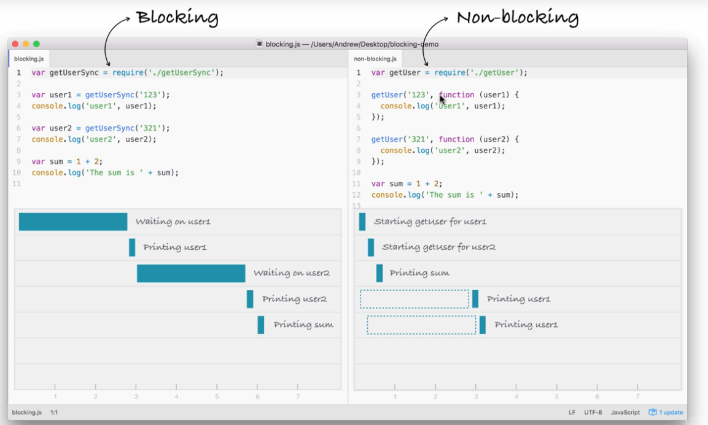

##What is Node
- Node is runtime JavaScript that uses V8 engine written in C++, that takes in JS code and compiles into C++ code
- [npmjs.com](npmjs.com)  many packages

##Global
- 使用Global keyword可以获得全局变量，跟javascript的window一样
- 使用Process可以拿到Node Process 就像在JS的Document 可以拿到当面页面的Dom

##Install package
####create package config
```
npm init
```
####Install package
```
npm install lodash --save
```
####install module based on package.json
```
npm install
```
##Feature
- Non-blocking IO（当作blocking IO操作的时候，接下来的操作被暂时阻挡了）
- 不等来自IO的data，下面的语句也可以进行了，等拿到data再做回调



#Grammar

##Common lib to use
- app.js intialization file for Node

```NodeJs
//file system
const fs = require('fs');
//operation system
const os = require('os');
//will give username, pid, uid, homedir, shell path
var user = os.userInfo();
const notes = require('./notes.js ');

```

##省略function keyword的anomynous function

```NodeJs
module.exports.add = (a, b) => {
  return a + b;
};
```

###lodash
	_.isString(string)
	//filter duplicates
	_.uniq(array)
